# <div align="center">👨‍💻 Hossam Mohamed Hassan</div>

<div align="center">
  
</div>

<div align="center">
  
[](https://git.io/typing-svg)

</div>

<div align="center">
  

[](https://github.com/hossamkoky599)
[](https://www.linkedin.com/in/hossamhassan99/)

</div>

---

## 🚀 About Me

```python
class HossamHassan:
    def __init__(self):
        self.name = "Hossam Mohamed Hassan"
        self.role = "Full Stack Developer"
        self.location = "El Qanater El Khayreya, Egypt"
        self.education = "Computer Science Graduate"
        self.current_focus = ["AI-powered Web Apps", "Django REST APIs", "React Development"]
        
    def get_skills(self):
        return {
            "languages": ["Python", "JavaScript", "PHP", "HTML5", "CSS3"],
            "frameworks": ["Django", "Flask", "React.js", "Laravel"],
            "databases": ["PostgreSQL", "MySQL"],
            "tools": ["Docker", "Git", "Linux", "Apache"],
            "cloud": ["PythonAnywhere", "Vercel"]
        }
    
    def get_status(self):
        return "Building scalable solutions & seeking new opportunities"
```

---

## 🛠️ Tech Arsenal

<div align="center">

### Languages & Frameworks


### Frontend Technologies


### Backend & Databases


### Tools & Platforms


</div>

---

## 📈 GitHub Analytics

<div align="center">
  
  
</div>

<div align="center">
  
</div>

<div align="center">
  
</div>

---

## 🏆 Featured Projects

<div align="center">

[](https://github.com/hossamkoky599/Crowd-Funding-Django)
[](https://github.com/hossamkoky599/Smart-Parking-System)

</div>

### 🎯 Project Highlights

| 🚀 Project | 📝 Description | 🛠️ Tech Stack | 🔗 Links |
|------------|----------------|---------------|----------|
| **Crowd Funding Platform** | Full-stack platform for project funding with user authentication & payment integration | Django REST, React, PostgreSQL | [Demo](https://github.com/hossamkoky599/Crowd-Funding-Django) |
| **Smart Parking System** | IoT-enabled parking management with real-time monitoring | Django, React, Arduino, AI | [View](https://github.com/hossamkoky599/Smart-Parking-System) |
| **Portfolio Website** | Responsive personal portfolio with modern design | React, TailwindCSS, Animations | [Live](https://github.com/hossamkoky599/Portfolio-) |

---

## 🎯 Current Focus

```mermaid
graph LR
    A[🤖 AI Integration] --> B[🌐 Web Development]
    B --> C[☁️ Cloud Deployment]
    C --> D[📱 Mobile-First Design]
    D --> A
```

<div align="center">



</div>

- 🔥 **Exploring:** GenAI integration in web applications
- 🚀 **Building:** Scalable Django REST APIs
- 🎨 **Designing:** Modern React UIs with animations
- ☁️ **Deploying:** Docker containerized applications
- 📚 **Learning:** Advanced Python patterns & clean architecture

---

## 🌟 Professional Journey

```python
timeline = {
    "2023": "🎓 Graduated with Computer Science Degree",
    "2022-2023": "💼 Summer Training - Full Stack PHP Development",
    "2025": "🚀 ITI Intensive Training - Python Full Stack Track",
    "Present": "🔍 Seeking Full Stack Developer Opportunities"
}
```

---

## 📫 Let's Connect!

<div align="center">

[](mailto:hossamhussan599@gmail.com)
[](https://www.linkedin.com/in/hossamhassan99/)
[](https://github.com/hossamkoky599/Portfolio-)
[](tel:+201060810842)

</div>

---

<div align="center">

### 💡 *"Code is like humor. When you have to explain it, it's bad."* – Cory House


**⭐ Star my repositories if you find them interesting!**

</div>

---

<div align="center">
  
</div>
